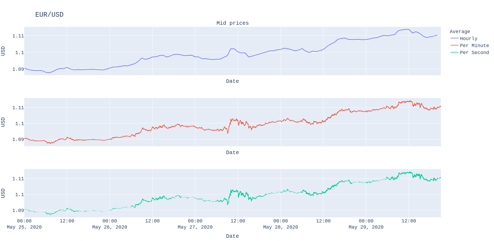
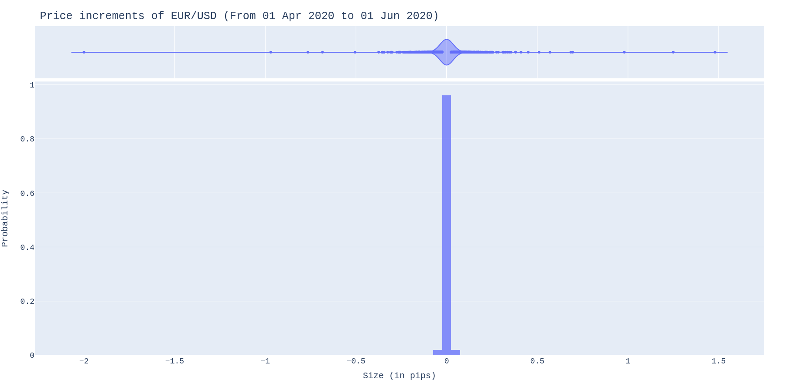
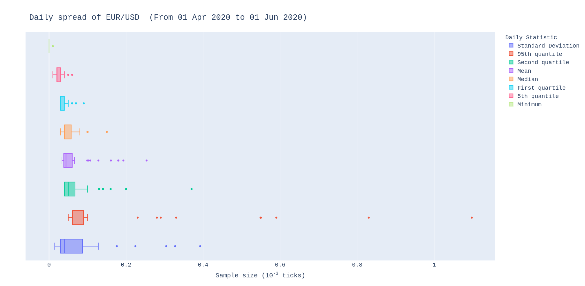
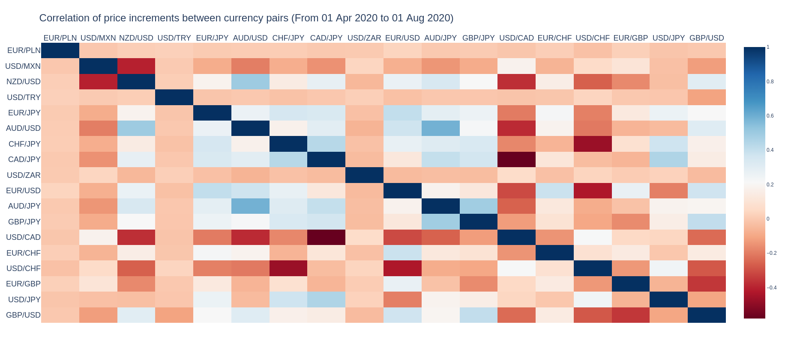
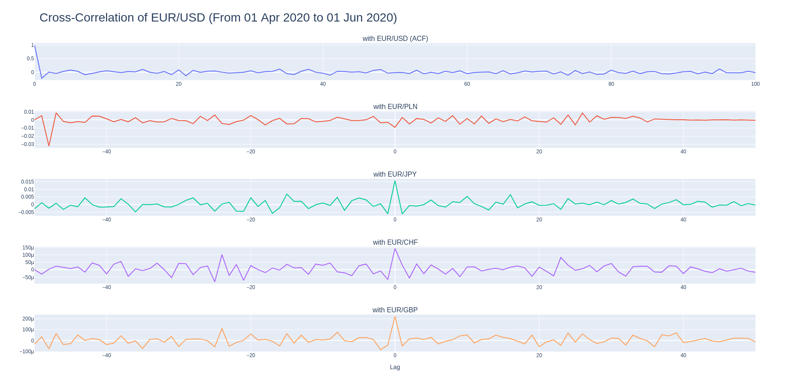

DL FX Forecasting
==============================

Python project for forecasting mid prices of different Foreign Exchange pairs.

## Run
-------------

Execute the following command to start the container:

```
docker run -it --rm jpxkqx/dl-fx-forecasting:firsttry
```

In case, the data is already in processed in the host machine, the following 
command may be more appropriate.

```
docker run -it -v "/path/to/data:/app/data" --rm jpxkqx/dl-fx-forecasting:firsttry
```

_The  path **/path/to/data** refers to the directory containing the data as 
presented in the project organization below. In case all processed information is available, it is possible to execute all scripts._


## Data

Read, load, preprocess and save the data for the currency pair specified. To go through this pipeline, the ZIP files have to be in the host machine, and the path to the folder containing this data must be specified as an environment variable called *PATH_RAW_DATA*. The following command process the data available in the host machine for currency pair EUR/USD.

```
generate_datasets eur usd
```

In this case, the historical data has been extracted from [True FX](https://www.truefx.com/truefx-historical-downloads/), whose first prices are shown below.


<center>

| FX pair | Timestamp | Low | High |
| -------|-----------------------|---------|---------|
|EUR/USD | 20200401 00:00:00.094 | 1.10256 | 1.10269 |
|EUR/USD | 20200401 00:00:00.105 | 1.10257 | 1.1027 |
|EUR/USD | 20200401 00:00:00.193 | 1.10258 | 1.1027 |
|EUR/USD | 20200401 00:00:00.272 | 1.10256 | 1.1027 |
|EUR/USD | 20200401 00:00:00.406 | 1.10258 | 1.1027 |
|EUR/USD | 20200401 00:00:00.415 | 1.10256 | 1.1027 |
|EUR/USD | 20200401 00:00:00.473 | 1.10257 | 1.1027 |
|EUR/USD | 20200401 00:00:00.557 | 1.10255 | 1.10268 |

</center>

This data is processed by the following command, which computes the mid price and spread and filter some erroneus data points. The processed information is stored using [Apache Parquet](https://parquet.apache.org/) in order to achieve faster reading times.

## Visualizations

Then, plot the currency pair *EUR/USD* for the period from 25 May, 202 to 30 May, 2020.

```
plot_currency_pair eur usd H T S --period 2020-05-25 2020-05-31
```

To get the following image,



There is also the possibility to plot the cumulative distribution function using the following command

```
plot_cdf eur usd increment --period 2020-04-01 2020-06-01
```

which gives the image shown below,




In order to plot the distribution of the main daily statistic of the spread, the following command can be used.

```
plot_stats eur usd spread D --period 2020-04-01 2020-06-01
```



In addition, the correlation between the different currency pairs aggregated by any timeframe can also be plotted for any given period of time. 

```
plot_pair_correlations increment --period 2020-04-01 2020-06-01 --agg_frame H
```




Lastly, the correlation between currency pairs is represented as follows,

```
plot_pair_acf increment eur usd --agg_frame 'H' --period 2020-04-01 2020-06-01
```




Project Organization
------------

    ├── LICENSE
    ├── Makefile           <- Makefile with commands like `make data` or `make train`
    ├── README.md          <- The top-level README for developers using this project.
    ├── data
    │   ├── external       <- Data from third party sources.
    │   ├── interim        <- Intermediate data that has been transformed.
    │   ├── processed      <- The final, canonical data sets for modeling.
    │   └── raw            <- The original, immutable data dump.
    │
    ├── docs               <- A default Sphinx project; see sphinx-doc.org for details
    │
    ├── models             <- Trained and serialized models, model predictions, or model summaries
    │
    ├── notebooks          <- Jupyter notebooks. Naming convention is a number (for ordering),
    │                         the creator's initials, and a short `-` delimited description, e.g.
    │                         `1.0-jqp-initial-data-exploration`.
    │
    ├── references         <- Data dictionaries, manuals, and all other explanatory materials.
    │
    ├── reports            <- Generated analysis as HTML, PDF, LaTeX, etc.
    │   └── figures        <- Generated graphics and figures to be used in reporting
    │
    ├── requirements.txt   <- The requirements file for reproducing the analysis environment, e.g.
    │                         generated with `pip freeze > requirements.txt`
    │
    ├── setup.py           <- makes project pip installable (pip install -e .) so src can be imported
    ├── src                <- Source code for use in this project.
    │   ├── __init__.py    <- Makes src a Python module
    │   │
    │   ├── data           <- Scripts to download or generate data
    │   │   └── make_dataset.py
    │   │
    │   ├── features       <- Scripts to turn raw data into features for modeling
    │   │   └── build_features.py
    │   │
    │   ├── models         <- Scripts to train models and then use trained models to make
    │   │   │                 predictions
    │   │   ├── predict_model.py
    │   │   └── train_model.py
    │   │
    │   └── visualization  <- Scripts to create exploratory and results oriented visualizations
    │       └── visualize.py
    │
    └── tox.ini            <- tox file with settings for running tox; see tox.readthedocs.io


